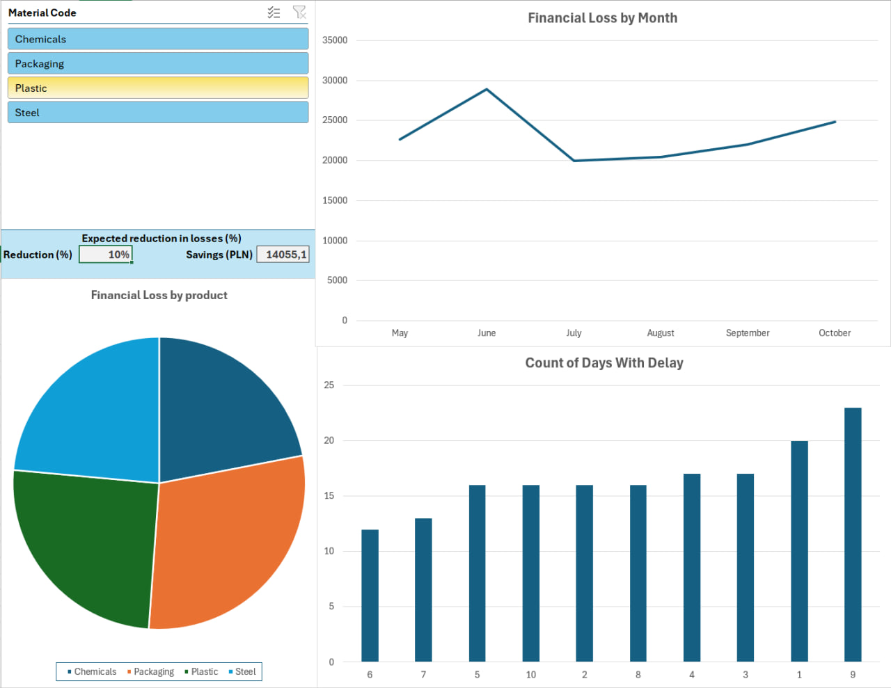

# Financial Loss Dashboard (Advanced Excel)

## Project Goal
The primary goal of this dashboard is to provide a clear, interactive visualization of financial losses caused by supply chain delays. It aims to give managers a focused tool for cost reduction planning and diagnostics.

***

## Dashboard Visualization

***

## Key Features & Business Value

This dashboard is built with the following features to drive operational decisions:

### 1. Dynamic Diagnostics
* **Functionality:** Uses **Slicers** to filter financial loss data instantly by material (e.g., Steel, Chemicals, Plastic) and time period.
* **Value:** Allows users to quickly diagnose which material or operational area contributes to the largest share of the total financial loss, focusing attention where it is needed most.

### 2. Financial Focus
* **Visualization:** Clearly visualizes the **Financial Loss by Month** and the **Count of Days With Delay**.
* **Value:** Directly connects daily operational issues (delays) to their financial impact (PLN), providing clear justification for process improvements.

### 3. What-If Analysis (Strategic Planning)
* **Tool:** Includes a built-in **"What-If"** calculator.
* **Value:** Managers can input a target loss reduction percentage (e.g., 10%) and instantly see the calculated **Projected Savings (PLN)**. This transforms the report from a historical log into a dynamic strategic planning tool.

### 4. Professional Delivery
* **Data Integrity:** The final file is **password-protected** and contains **hidden sheets** to secure the underlying raw data and calculation formulas.

***

## Skills Demonstrated
* Advanced MS Excel (Pivot Tables, Lookups, Conditional Formatting)
* Data Visualization & Dashboard Design
* Financial Modeling (What-If Scenarios)
* Data Integrity & Security Practices
